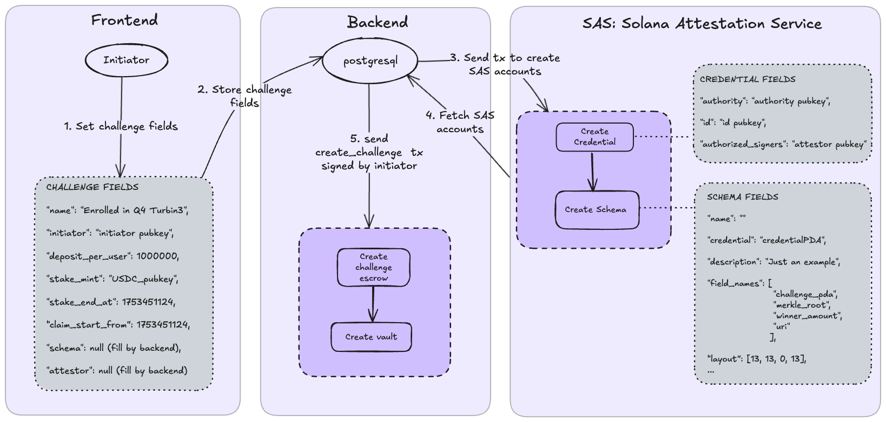
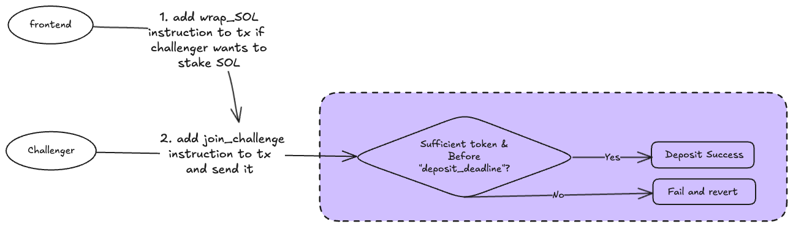
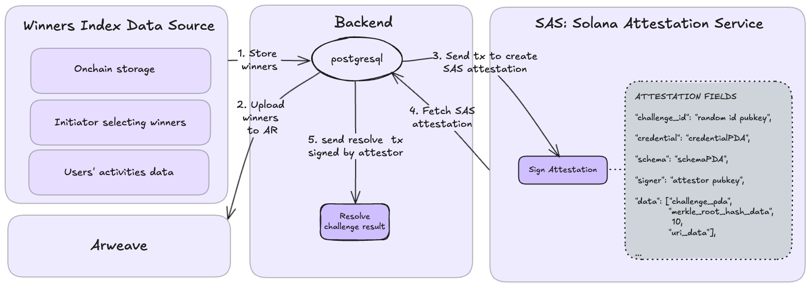
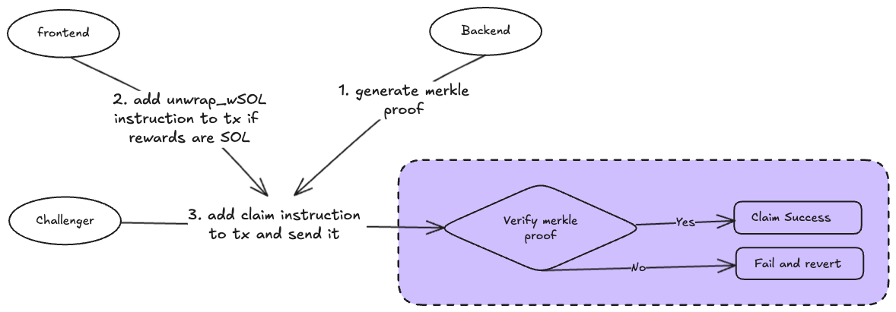

# **Descipline – An open Challenge Arena where discpline is rewarded**

>  Put money on the line, prove your success, and earn rewards — all trustless, transparent, and on-chain.

---

## **🌟 Overview**
- Descipline is a decentralized platform that turns self-discipline into real rewards.  
- Users can create or join **time-based or usage-based challenges**, staking funds before a deadline.  
- Winners — verified via **merkle proof verification** — reclaim their stake and share forfeited funds from those who didn’t succeed.
- Attestation - backed by [**Solana Attestation Service**](https://attest.solana.com/)

**Key features:**
- **Trustless Escrow:** All funds locked in Solana smart contracts.  
- **Transparent Verification:** Proofs of success via Solana Attestation Service.  
- **Open Arena:** Anyone can create or join challenges.  
- **Fair Rewards:** Stake from non-completers distributed to winners.

---

## **🛠 How It Works**

**High-level flow:**
1. **Create Challenge**  
   - Initiator sets challenge details (goal, stake amount, deadline).  
   - Contract stores challenge data on-chain.  
   - Backend integrates with **Solana Attestation Service** to set credential & schema storage.  

2. **Join Challenge**  
   - Challenger deposits SPL tokens before deadline.  
   - If staking SOL, frontend auto-wraps to wSOL.  

3. **Attestation & Winner Resolution**  
   - At challenge end, attestor signs attestation.  
   - Backend indexes winners, stores results in DB, uploads to Arweave.  
   - Merkle root of winner list stored on-chain for verification.  

4. **Claim Rewards**  
   - Winners submit Merkle proof to claim stake + share of forfeits.

---

## **📂 Project Structure**
- [frontend repository](https://github.com/Descipline/descipline-frontend)

- [smart contracts repository](https://github.com/Descipline/descipline-smart-contracts)
